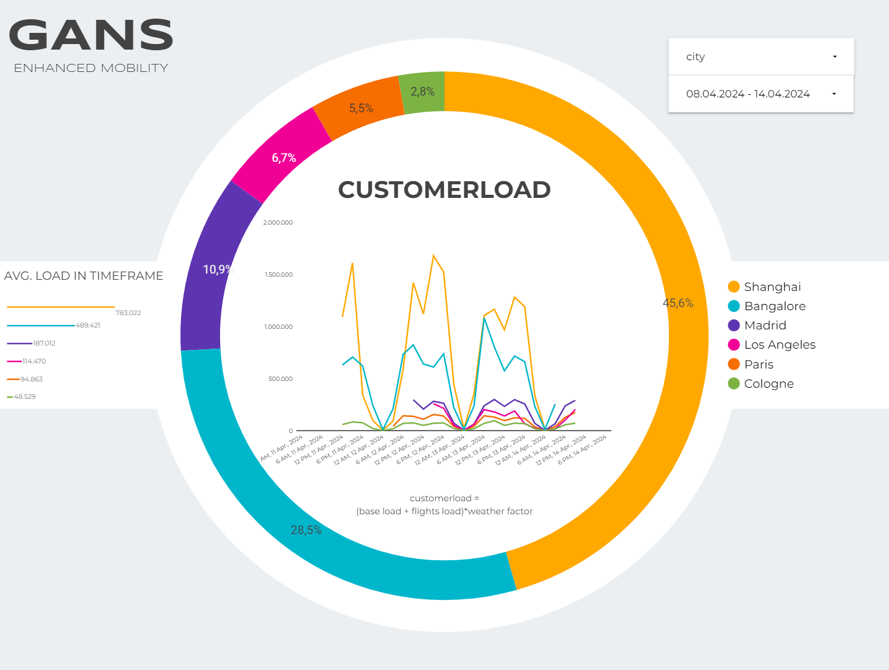
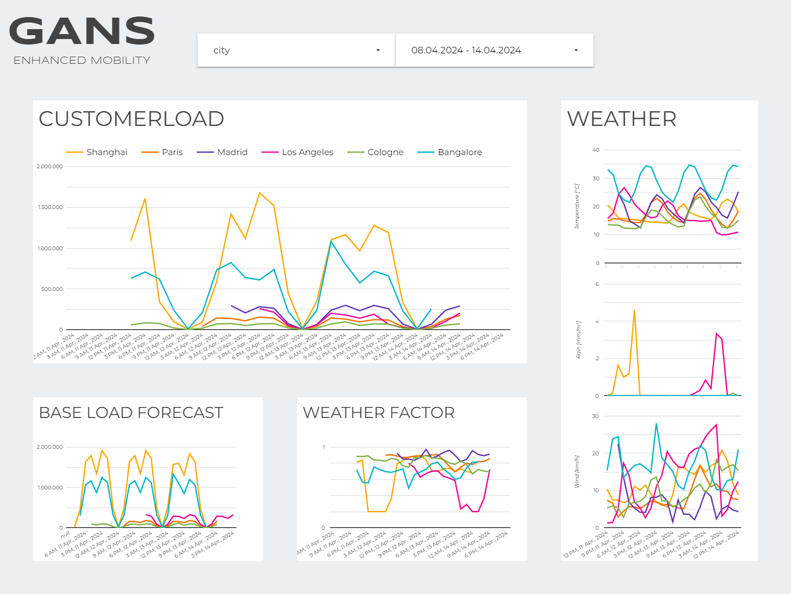
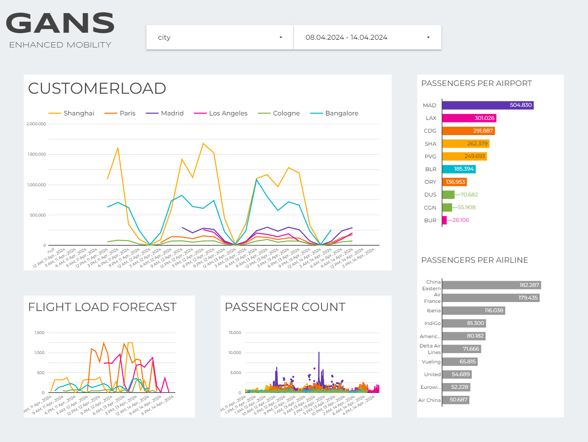
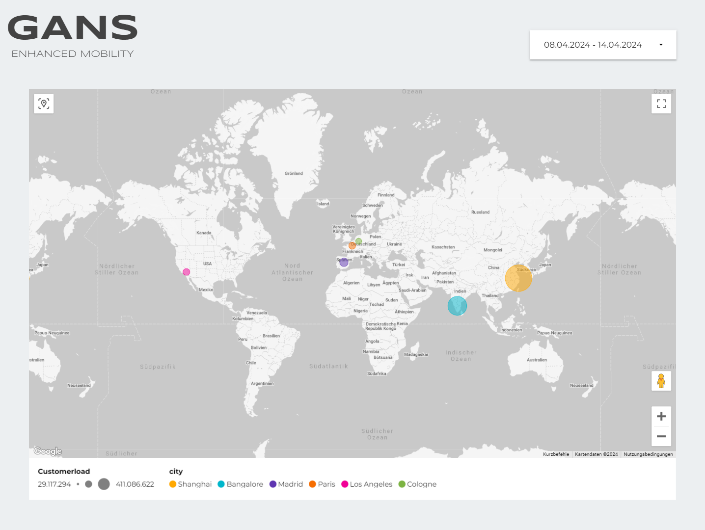
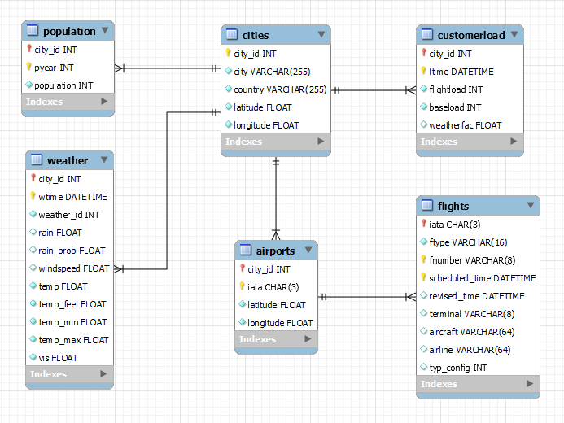
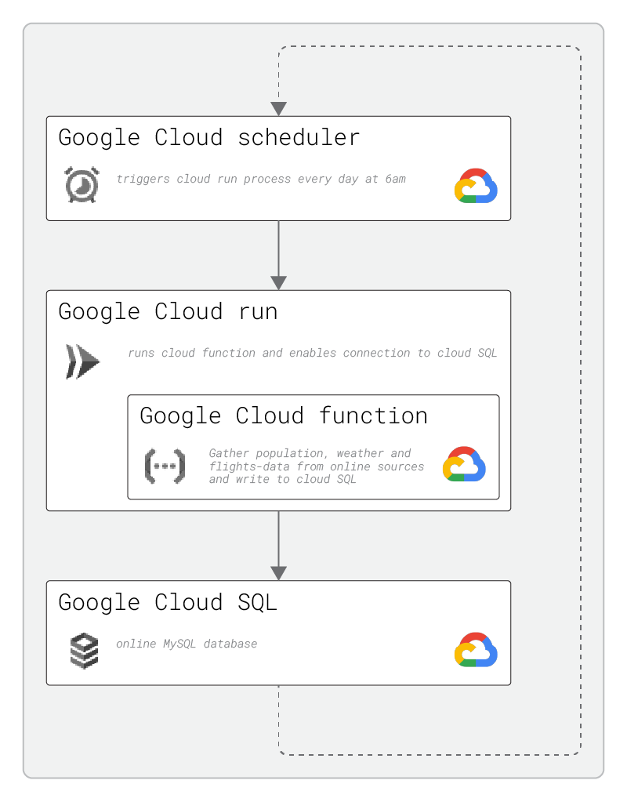
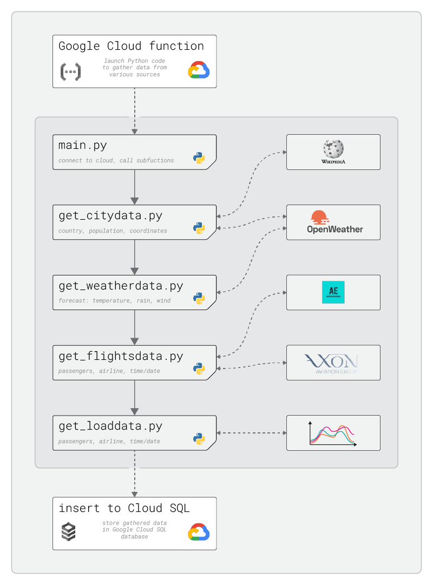

# GANS Data Engineering Project

## Project Goal
This project was done as part of a data science bootcamp for a fictional company called "Gans".
Gans is a provider of electric scooters for rent.
For their business they want to know data about certain cities: population, weather-data and potential customers arriving via airplane.

So the task is to create an accessible database to provide them with up-to-date insights to these topics.
I personally expanded the goals of the project by also setting up a basic demand-"model" and an online-dashboard.

## Results

Below you can see screenshots of the online-dashboard made with Google Looker Studio. 
Please follow this <a href="https://lookerstudio.google.com/reporting/d217368a-f033-457d-8f9d-307d04ae46d5">[Link]<a/> to find the interactive dashboard on Google Looker Studio!
 
 
 
 

## Project Setup

The project is split in 6 distinct parts:
  
1. Gather population, weather and flights-data from online sources. 
   *Tools: Python, Pandas*
     
3. Setup basic models on customerdemand (base demand, demand through aviation, influence of weather) 
   *Tools: Python, Pandas, Numpy*
     
5. Setup local MySQL database and fill it with the gathered data. 
   *Tools: MySQL Workbench, Python, Pandas*
     
7. Establish local data-pipeline on Google Cloud Platform. 
   *Tools: Google Cloud (GC) Functions, GC Run, GC SQL, GC Scheduler*
     
9. Create online dashboard to visualize and analyze gathered data. 
   *Tools: Google Looker Studio.*
     

### Database setup

The database is first setup locally in MySQL workbench and later on pushed to Google Cloud.
A total of 6 tables exists in the "Gans"-Schema:
1. Cities 
   *Central table, contains city names and IDs among others*
     
2. Population 
   *Contains city-populations per year*
     
3. Weather 
   *Contains weatherforecast for the next 48h in 3h intervals*
     
4. Airports 
   *Relates airport-IATA-codes to respective city-IDs. also contains airport-locations*
     
5. Flights 
   *Contains flight information for the next 48h*
     
6. Customerload 
   *Customer demand prediction based on population-, weather- and flights-data*
 
 

### Google Cloud Platform

To provide easy accessability and automated updating of the database, the project is hosted on Google Cloud Platform (GCP).
Here, the data-gathering python code is executed daily and writes it's result to the online database.
See the GCP setup in the next image:
 
 

### Data gathering with Pandas

The required data is gathered from different online-sources using the Pandas-library for Python among others.
Code related to the various types of data (cities, weather, flights, customer demand) is organized in individual *.py-files.
These functions are called from a main py-file that also contains the necessary code to make the project executable on GCP.
See the program setup in the next image:
 
 

### Customer demand forecast

Prediction of customer demand takes 3 different data-sources into account: city-data, flights-information and weather-data.
Firstly a "baseload" is defined based on a city's population. The baseload generally follows a spline-curve with peaks during the typical rush hour times in the morning and evening.
 
 
To model additional demand from customers departing or arriving by airplane, flights-information is used. For this, the aircraft-type information for each flight is used.
The code queries an aircraft information table from <a href="http://www.axonaviation.com/commercial-aircraft/aircraft-data/aircraft-specifications">[this source]</a> and retrieves typical seat configurations for the individual aircraft.
Based on a passenger load factor of 82.6% (<a href="https://www.statista.com/statistics/658830/passenger-load-factor-of-commercial-airlines-worldwide/#:~:text=Commercial%20airlines%20worldwide%20%2D%20passenger%20load%20factor%202005%2D2023&text=Global%20airlines'%20combined%20passenger%20load,factor%20dropped%20to%2065%20percent">[Statista]</a>) an overall amount of passengers can be estimated.
 
 
Lastly, the influence of weather conditions needs to be considered. For this purpose, the values for temperature, rain and wind are evaluated. If a value is below a certain minimum (e.g. there's little or no rain on a given day) a corresponding "weather-factor" may have a value of 1. If a weather-value is above a certain maximum (e.g. there's heavy rain) the "weather-factor" may reduce to 0.
 
 
The total predicted customer demand is calculated as $` (baseload + flightload)\cdot weather factor `$.
 
 

## Outcome and recap

The project setup successfully gathers the required data from various only sources and stores it to the database.
This happens automatically every day at 6am.
 
Beyond the "official" requirements this setup also features a simple load forecast based on city-, flight- and weatherdata as well as an online dashboard for visualization and analysis.
For further developments it is thinkable to improve the forecast model and to integrate more data-sources. This additional data could be about public transport (e.g. people arriving by train and potentially switching to a scooter) or public events like trade fairs or sport events.

