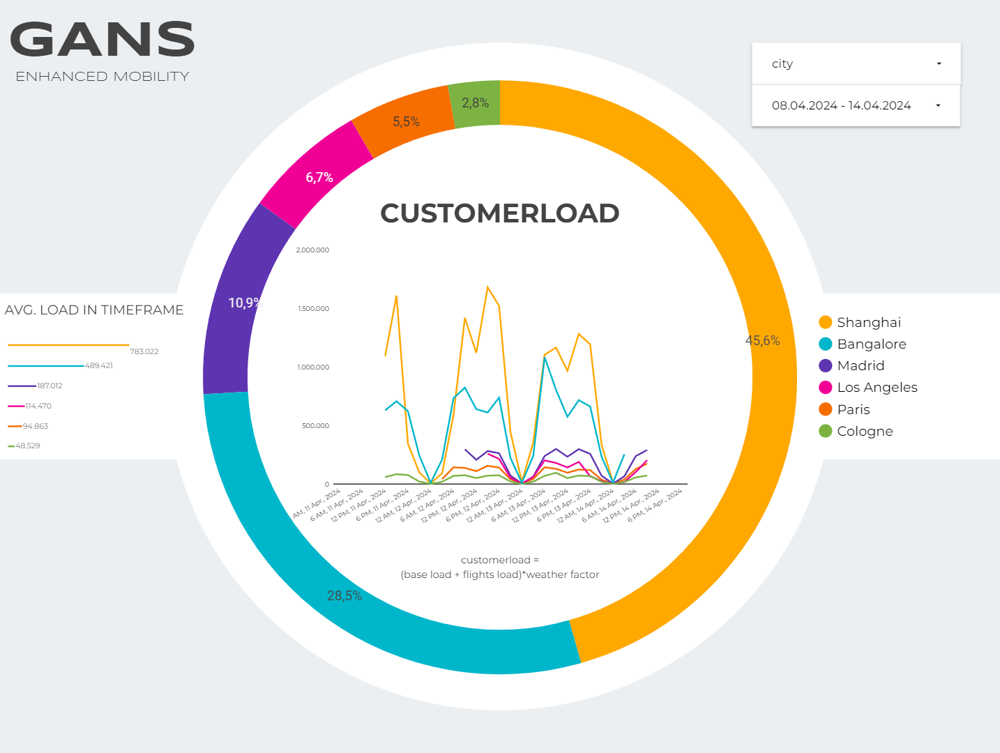
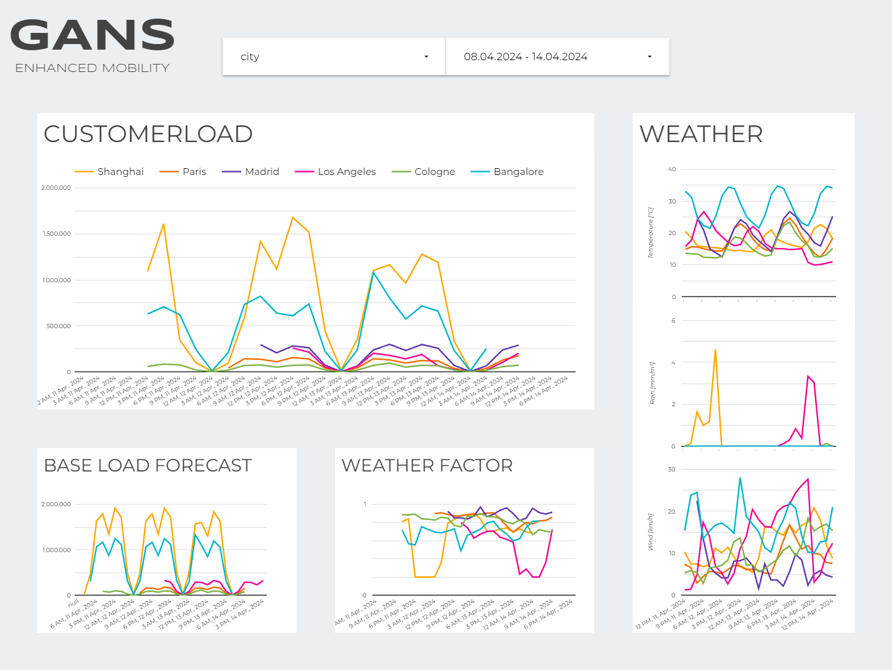
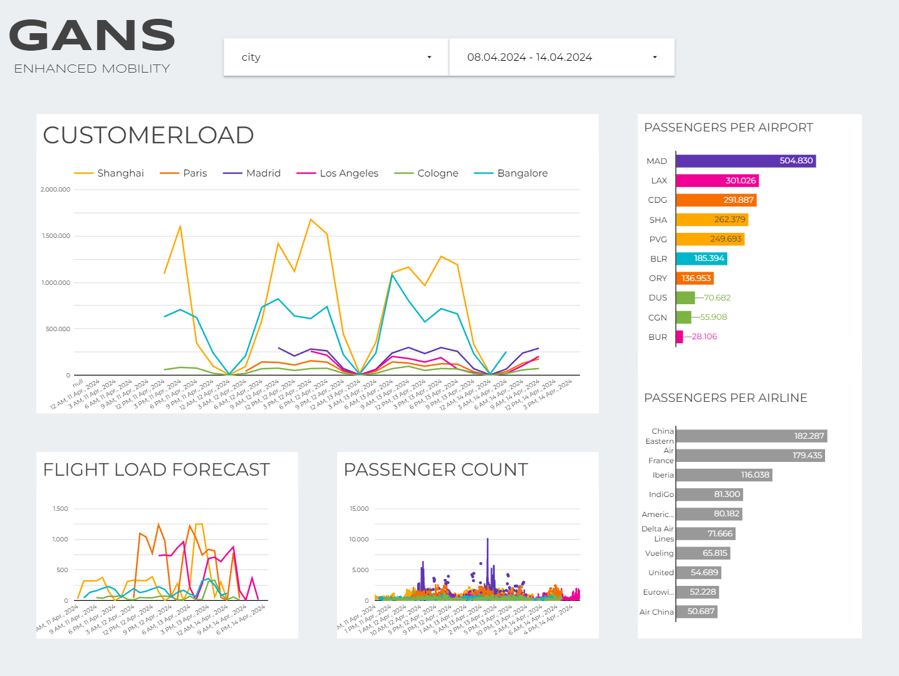
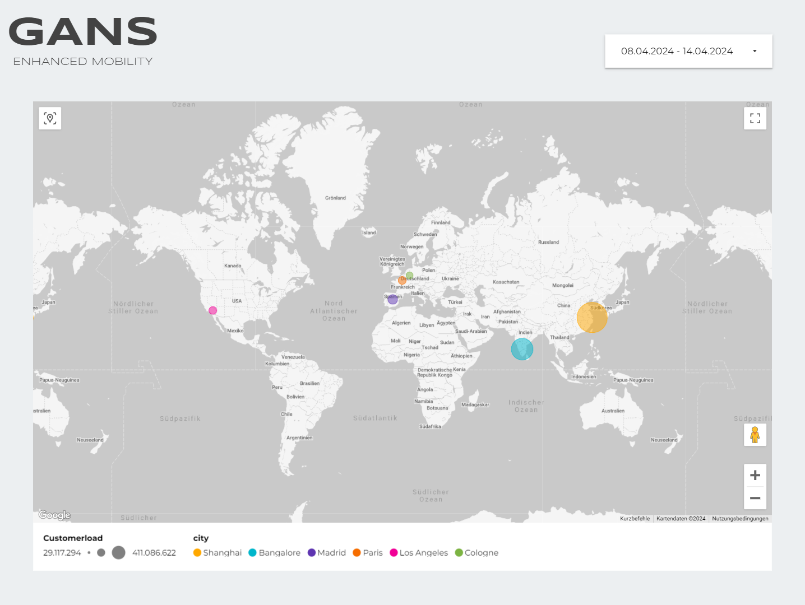
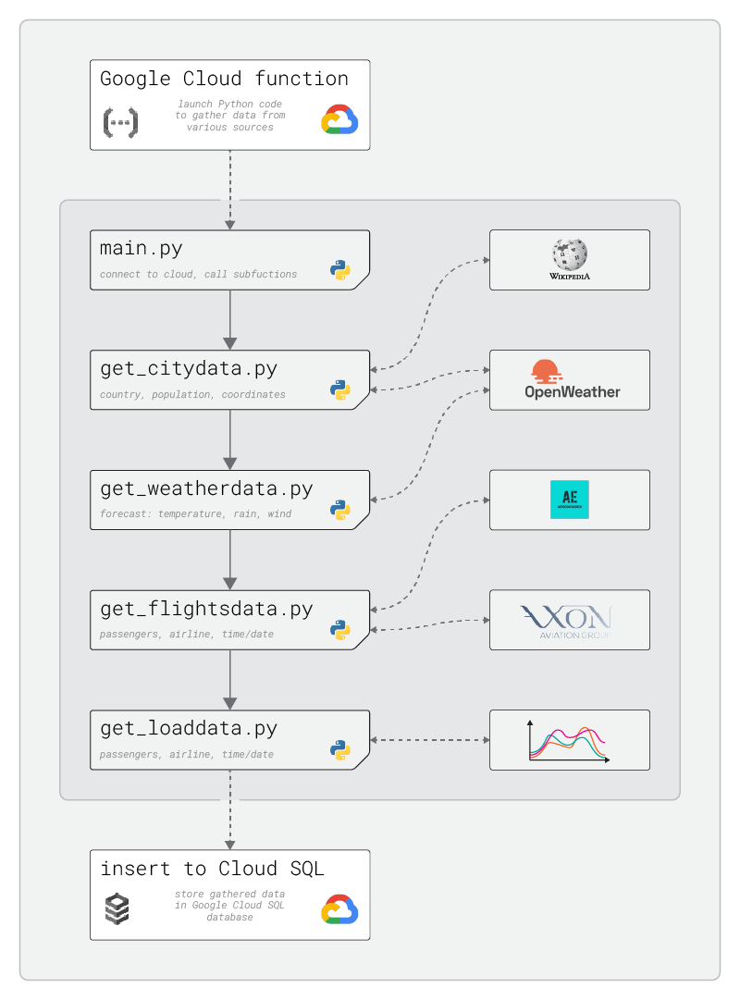

# GANS Data Engineering Project

## Project Goal
This project was done as part of a data science bootcamp for a fictional company called "Gans".
Gans is a provider of electric scooters for rent.
For their business they want to know data about certain cities: population, weather-data and potential customers arriving via airplane.

So the task is to create an accessible database to provide them with up-to-date insights to these topics.
I personally expanded the goals of the project by also setting up a basic demand-"model" and an online-dashboard.

## Some results

Please follow this <a href="https://lookerstudio.google.com/reporting/d217368a-f033-457d-8f9d-307d04ae46d5">[Link]<a/> to find the interactive dashboard on Google Looker Studio!

 
 

## Project Setup

The project is split in distinct parts:
1. Gather population, weather and flights-data from online sources.
   Tools: Python, Pandas
2. Setup basic models on customerdemand (base demand, demand through aviation, influence of weather)
   Tools: Python, Pandas, Numpy
4. Setup local MySQL database and fill it with the gathered data.
   Tools: MySQL Workbench, Python, Pandas
5. Establish local data-pipeline on Google Cloud Platform.
   Tools: Google Cloud (GC) Functions, GC Run, GC SQL, GC Scheduler
6. Create online dashboard to visualize and analyze gathered data.
   Tools: Google Looker Studio.

